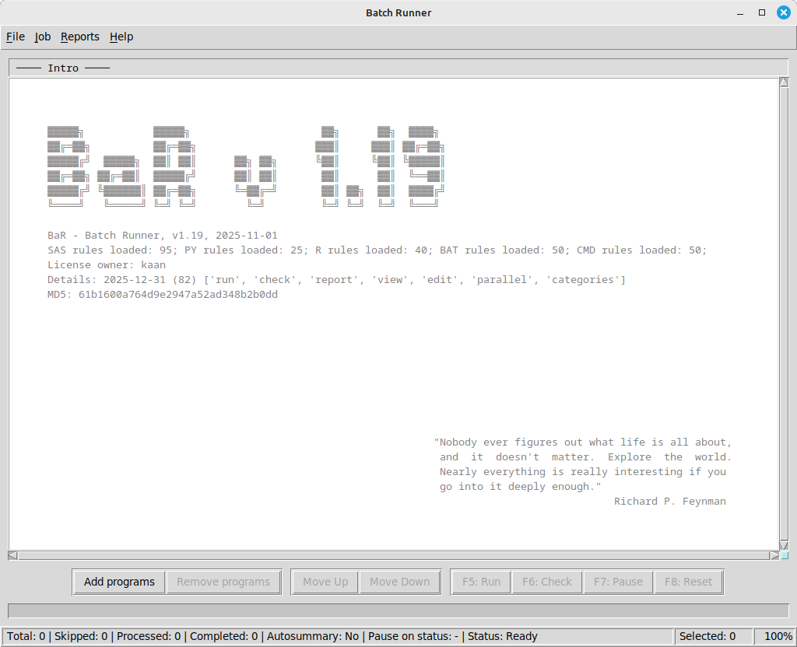
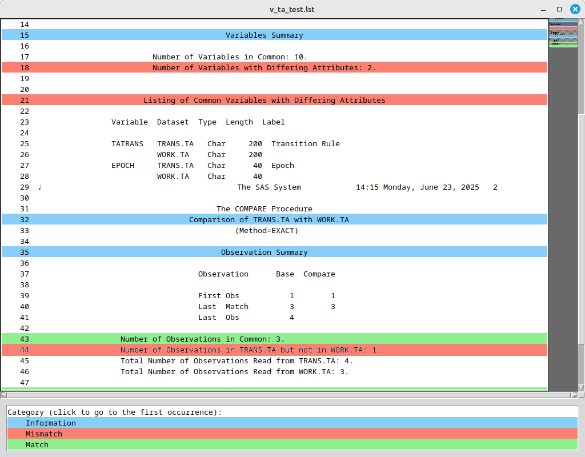

# Batch Runner (BaR)
<!--img src="splash_list480.png" width="32"-->

### Overview
**Batch Runner (BaR)** is a tool designed for statistical programmers to execute and validate sets of SAS, PY and R programs, BAT and CMD batch files. It provides functionality to:

- Add programs to the list (job) using menu, buttons, hotkeys and drag-and-drop, remove programs, save and load jobs
- Run programs or batch files sequentially or in parallel
- Categorize programs or batch files for organized execution
- Manage program execution with skip, pause and reset options
- Analyze program outputs (LOG\LST files, and optionally validation datasets for SAS programs)
- Highlight identified issues (errors, warnings, problematic messages in LOG files, validation information from LST files) in main window in real time, in built-in viewers and reports
- Generate detailed XLSX reports with color coding and autofilters
- Edit programs in buit-in editor with syntax highlighting
- Retrieve author information from Git or SVN (if available)
- Access all functions in three ways: via menus, hotkeys, or context menus
- Register file associations for `.bar`, `.log`, or `.lst` files through the File menu
- Open `.bar`, `.log`, or `.lst` files via command-line parameters, for example:
```
> bar.exe "c:\Project1\ADB\adb.bar"
```
The application supports multiple languages, color themes, and includes logging capabilities.

 

---

### Main Menu
Provides access to the application's functionality through several sections:

1. **File** menu - Job management (new, load, save, recent jobs), program management (add programs to the job or remove them), some settings
2. **Job** menu - Program execution, sorting, applying categoies, run type, encoding (for SAS)
3. **Reports** menu - Log analysis and reporting tools
4. **Help** menu - Information about the program, help articles

Each menu section contains commands related to specific operations.

---

### File Menu
Contains commands for job management:

- **New Job**  (Ctrl+N) - Create a new empty job
- **Load Job** (Ctrl+O) - Open an existing job file (.bar)
- **Save Job** (Ctrl+S) - Save current job to file (.bar)
- **Recent Files** - List of recently opened jobs, Ctrl+Alt+R opens the most recent file
- **Add Programs** (Ctrl+A) - Add programs to current job
- **Remove Programs** (Ctrl+R) - Remove selected programs
- **Undo\Redo** (Ctrl+Z) - Undo\\redo last change
- **Language** - Change application language (restart required)
- **Color theme** - Change colors in text areas
- **Pause on status** - Select log statuses that will pause execution. In parallel execution, all programs that were started simultaneously with the program that caused the pause will be executed and checked.
- **File associations** - register or unregister .bar, .log and .lst file types to be opened with BaR (for current user only)
- **Quit** (Ctrl+Q) - Exit the application, suggest to save the job if it was changed, save settings to the ini file

---

### Job Menu
Contains commands for program execution and organization:

**Sort By**:
- **Category** - Sort programs by category
- **Program** - Sort programs by name
- **Category+Program** - Combined sort
- Reverse options available for each sort type
- Checkbox "**Uncategorized last**" to keep uncategorized section at the end of the list

Execution:
- **Run** (F5) - Execute selected programs and check log\lst files and SAS validation dataset optionally
- **Check** (F6) - Check log\lst\datasets without execution
- **Pause** (F7) - Pause current execution
- **Reset** (F8) - Reset execution status
- **Run selected** (Shift+F5) - Execute only selected programs and check logs and other files
- **Check selected** (Shift+F6) - Check logs and other files for selected programs without execution
- 
Program Management:
- **Skip** (Shift+S) - Toggle skip status for selected programs
- **Change category** (Shift+C) - Modify program category
- **Change run type** (Shift+R) - Set parallel/sequential execution for selected category
- **Change encoding** (Shift+E) - Set encoding (en\\u8) for SAS programs
- **Auto categorize** - Assign categories automagically based on program names (ADaM\SDTM\TLF with PROD\VAL postfixes)
- **Create missing pairs** - Look through the list of existing programs (ADaM\SDTM\TLF) and create opposite side records if not found - for example, if only production side programs were identified, then records for validation sides will be created.
---

### Reports Menu
Provides tools for log analysis:

- **LOG Summary**  (F9) - Overview of log issues
- **LOG Details** (F10) - Line-by-line log analysis
- **Prog.Summary** (F11) - Overview of issues related to integrity of the run (missing programs, date discrepancies etc)
- **Open LOG** (Enter) - View selected program log in internal viewer
- **Open LST** (Ctrl+Enter) - View selected program LST in internal viewer
- **Open Program** (Shift+Enter) - Edit program in internal editor with syntax highlight
- **LOG check results** (Alt+Enter) - Displays LOG check results for selected files
- **File information** (Shift+I) - Show information about selected file(s): name, date, full path, author\email information from version control system if exist
- **GIT|SVN show log** (Shift+L) - Show information from the git or svn log (revisions, authors, dates, comments)
- **GIT|SVN diff** (Shift+D) - Show diff information from the git or svn
- Checkbox "**Autosummary**" - Toggle automatic Log Summary generation at the end of each run

---

### Main Window
The main window displays the list of programs divided into groups or categories. Each group will be launched separately during the run, and you can specify whether the programs in the group should be run sequentially or in parallel.
You can add or remove programs from the list, save the list of loaded programs (job), and open saved lists (jobs).
After loading a job and after launching the programs, several checks are performed: for example, the dates of the programs and logs are compared, and messages in the LOG files are verified.
Detected issues are displayed in the main window with color coding for better visibility.
You can select multiple records using LMB with Ctrl\Shift modifiers or by clicking on the category separator.

 

Columns:
1. Program index
2. Program filename
3. Encoding (for SAS only)
4. Program Date - Last program modification date
5. Log Date - Last LOG modification date
6. Comp - Comparison results from validation dataset (for SAS only, if available, this column can be disabled in ini file)
7. LST - Comparison details from validation LST file (Equal\\Unequal)
8. Status (Line) - Current LOG status (worst message type - PROHIBITED\RESTRICTED\CONDITIONAL\INFORMATIONAL or CLEAN if no such messages) and line in the log with first occurence of this message type.

If the program date is later than the log date, a ">" mark will be added between the dates with red color highlighting.
When a validation SAS dataset is identified, the 'Comp' column will show the PROC COMPARE results with color highlighting: green for comparison result of 0 (match) and red for any non-zero result (mismatch).
LST column provide summary for comparison details identified in validation LST file with color coding - green for Equal, red for Unequal.
For all these cases text lines will be amended with appropriate tooltip.

Hotkeys:
- Up/Down - Navigate program list
- LMB, Ctrl+LMB, Shift+LMB - Select required programs, click on category name to select all programs in the category
- Ctrl+Up/Down - Move selected programs
- Enter - Open log viewer
- Ctrl+Enter - Open LST viewer
- Shift+Enter - Open program editor
- Shift+S - Toggle skip status
- Shift+C - Change category
- Shift+R - Change run type
- Shift+E - Change encoding
- Shift+I - Show file information
- Shift+L - Show log from version control system
- Ctrl+Alt+R - Load most recent job
- Ctrl+Z - Undo\\Redo last operation
- Ctrl+Plus\\Ctrl+Minus\\Ctrl+0 - Adjust font size
Please see main menu for more hotkeys.

Context Menu (Right-click):
- Run selected
- Check selected
- Skip/Unskip
- Change category
- Change run type
- Change encoding
- Open Log/LST Viewer
- Open program editor
- File information
- GIT|SVN log
- GIT|SVN diff 
- Remove Programs
- Undo/Redo

---

### LOG Viewer
The Log Viewer displays program log files with analysis:


Features:
- Color-coded message types (Prohibited, Restricted, Conditional, Informational)
- Line numbers for reference
- Summary section with message counts for each identified category
- Filter checkboxes to show/hide message types
- Minimap – a graphical schematic representation of the text with color-coded entries.
- Open the source program via the context menu.
  
Navigation:
- Up/Down - Scroll line by line
- PgUp/PgDn - Scroll page by page
- Home/End - Jump to start/end
- Click summary items to jump to first occurrence
- Filter records (for example, turn off clean records), then select required message and switch filters again - you will be moved to required line in full or filtered log
- Use the minimap for quick navigation through the text.
- Use the button with the arrow below the vertical scrollbar to jump to the next available message.

Context Menu (Right-click):
- Copy selected text
- Find selected text in source program
- Find selected text in Google

Hotkeys:
- Esc/Enter - Close window
- Ctrl+C - Copy selected text
- Ctrl+G - Go to line
- F1 - Help

---

### LST Viewer
The LST Viewer displays program output (LST) files:



Features:
- Color-coded records
- Identification of proc compare information blocks, lines with matches/mismatches, color highlighting of records
- Line numbers for reference
- Summary section with detected records
- Minimap – a graphical schematic representation of the text with color-coded entries.

Navigation:
- Up/Down - Scroll line by line
- PgUp/PgDn - Scroll page by page
- Home/End - Jump to start/end
- Click summary items to jump to sections
- Use the minimap for quick navigation through the text.

Context Menu (Right-click):
- Copy selected text
- Find selected text in Google

Hotkeys:
- Esc/Enter - Close window
- Ctrl+C - Copy selected text
- F1 - Help

---

### Info Viewer
The Info Viewer displays information about selected files:


Features:
- Shows program name with additional information if identified - type (SDTM, ADaM, TLFs), category, date, full path, current status, list of authors from version control system (git or svn) if exist

Navigation:
- Up/Down - Scroll line by line
- PgUp/PgDn - Scroll page by page
- Home/End - Jump to start/end

Context Menu (Right-click):
- Copy selected text
- Find selected text in Google

Hotkeys:
- Esc/Enter - Close window
- Ctrl+C - Copy selected text
- F1 - Help

---

### CHK Viewer
The CHK Viewer displays LOG check results for selected files:


Features:
- Shows program name with additional information if identified - type (SDTM, ADaM, TLFs), category, and list of lines from the LOG with PROHIBITED\RESTRICTED\CONDITIONAL\INFORMATIONAL messages. In free mode this viewer replace LOG viewer.

Navigation:
- Up/Down - Scroll line by line
- PgUp/PgDn - Scroll page by page
- Home/End - Jump to start/end

Context Menu (Right-click):
- Copy selected text
- Find selected text in Google

Hotkeys:
- Esc/Enter - Close window
- Ctrl+C - Copy selected text
- F1 - Help

---

### GIT\SVN Log Viewer
This viewer displays version control system (git or svn) log for selected files:


Features:
- Shows program name with related GIT\SVN Log information if identified - revisions, authors, dates, comments.

Navigation:
- Up/Down - Scroll line by line
- PgUp/PgDn - Scroll page by page
- Home/End - Jump to start/end

Context Menu (Right-click):
- Copy selected text
- Find selected text in Google

Hotkeys:
- Esc/Enter - Close window
- Ctrl+A - Select all lines
- Ctrl+C - Copy selected text
- F1 - Help

---

### GIT\SVN Diff Viewer
This viewer displays version control system (git or svn) diff information for selected files:

Features:
- Shows program name with related GIT\SVN Diff information if identified. Initially get diff for working copy and last commited revision, if no differences, then get diff for previous revision.

Navigation:
- Up/Down - Scroll line by line
- PgUp/PgDn - Scroll page by page
- Home/End - Jump to start/end

Context Menu (Right-click):
- Copy selected text
- Find selected text in Google

Hotkeys:
- Esc/Enter - Close window
- Ctrl+A - Select all lines
- Ctrl+C - Copy selected text
- F1 - Help

---

### Program Editor
Internal program editor for quick program updates:


Features:
- Simple text editor for SAS, R, py programs, BAT and CMD files
- Syntax highlight (keywords, numbers and text strings)
- Text search

Navigation:
- Up/Down - Scroll line by line
- PgUp/PgDn - Scroll page by page
- Home/End - Jump to start/end

Context Menu (Right-click):
- Copy selected text
- Cut selected text
- Paste copied text
- Find selected text in Google

Hotkeys:
- Ctrl+F - Search dialogue
- Ctrl+S - Save file
- Ctrl+A - Select all lines
- Ctrl+C - Copy selected text
- Ctrl+X - Cut selected text
- Ctrl+V - Paste copied text
- Ctrl+Z - Undo last changes
- Ctrl+Y - Redo last changes
- F1 - Help

---

### Summary Report
The Summary Report provides an overview of log issues:

 


Features:
- List of all programs with issue counts
- Color-coded by issue severity
- Filter checkboxes to show/hide issue types
- Export to Excel functionality
- Auto-filter and color-coding in excel report for easy navigation

Columns:
1. No - Program index
2. Log Name - Log filename
3. Messages - Message category
4. Count - Number of occurrences for each category
5. Comments - Empty column for notes

Hotkeys:
- Esc/Enter - Close window
- F1 - Help

---

### Detailed Report
The Detailed Report provides line-by-line log analysis:


Features:
- Complete log content with line numbers
- Color-coded by message type
- Filter checkboxes to show/hide message types
- Export to Excel functionality
- Auto-filter and color-coding in excel report for easy navigation

Columns:
1. No - Program index
2. Log Name - Log filename
3. Line - Line number
4. Category - Message type
5. Message - Log content
6. Comments - Empty column for notes

Hotkeys:
- Esc/Enter - Close window
- F1 - Help

---

### Program Summary Report
This report provides an overview of issues related to integrity of the run:

 


Features:
- List of all programs with their counterparts (production\validation)
- Provide list of issues identified for each pair of programs and their logs: if counterpart is missing, if log should be checked, if program is newer than the log, if production log is newer than the validation log, if same author participated on both sides (if git or svn used).
- Export to Excel functionality
- Auto-filter and color-coding in excel report for easy navigation

Columns:
1. No - Program pair index
2. Dev.Prog.Name - Production (development) program name
3. Dev.Prog.Date - Production program date
4. Dev.LOG Date - Production program LOG date
5. Dev.LOG Status - Worst message type in production LOG
6. Author(s) - List of authors from version control software if exist (git or svn) for production program
7. Val.Prog.Name - Validation program name
8. Val.Prog.Date - Validation program date
9. Val.LOG Date - Validation program LOG date
10. Val.LOG Status - Worst message type in validation LOG
11. Author(s) - List of authors from version control software if exist (git or svn) for validation program
12. Comments - List of identified isues

Hotkeys:
- Esc/Enter - Close window
- F1 - Help

---

### Configuration File
The application settings are stored in bar.ini:

[EXECUTION]
- sas_exe - Path to SAS executable
- sas_par - SAS execution parameters
- py_exe - Path to Python executable
- py_par - Python execution parameters
- r_exe - Path to R executable
- r_par - R execution parameters
- bat_exe - Path to command line interpreter
- bat_par - BAT execution parameters
- cmd_exe - Path to command line interpreter
- cmd_par - CMD execution parameters
- timeout - Execution timeout in seconds
- stop_on - Log statuses that will pause execution (PRCI)
- chkfile - Create CHK file with tagged lines from the LOG (PRCI)
- syntsas - keywords to be highlighted in program editor for SAS programs
- syntr - keywords to be highlighted in program editor for R programs
- syntpy - keywords to be highlighted in program editor for PY programs
- syntbat - keywords to be highlighted in program editor for BAT scripts
- syntcmd - keywords to be highlighted in program editor for CMD scripts
- sdtmreg - Regex for SDTM type of programs
- adamreg - Regex for ADaM type of programs
- tlfsreg - Regex for TLF type of programs
- readcomp - True\False flag ot read validation dataset or not
- compid - Validation dataset ID column
- compdt - Validation dataset datetime stamp column
- comprc - Validation dataset result column

You can use wildcards %PRG%, %LOG%, %ENC% for program, log name, encoding in xxx_par parameters.
The last 7 options are used to:
1) Identify type of the program (SDTM\ADaM\TLF)
2) Identify validation programs
3) Locate the validation SAS datasets
4) Map the PROC COMPARE results to each validation program in the list

[APPLICATION]
- language - Interface language (EN, etc.)
- colwidth - Column widths in main window
- fontsize - Size of the font for the main window
- resolution - Main window dimensions
- sumresolution - Summary report dimensions
- detresolution - Detailed report dimensions
- helpresolution - Help window dimensions
- inforesolution - Info window dimensions
- threads - Max parallel threads
- uncat_last - Show uncategorized last
- no_intro - Skip intro message
- autosummary - Auto-generate summary report
- recentcount - Number of recent files to keep
- tooltipdelay - Tooltip delay in ms
- completebell - True\False flag to trigger system-defined bell sound (if defined) once run is completed
- update_ui - delay in ms and number of repeats after the run is completed
  
[EXCL_SAS] - User-defined SAS exclusion rules (will remove SAS log message from other categories if identified)
[EXCL_PY] - User-defined PY exclusion rules (will remove R log message from other categories if identified)
[EXCL_R] - User-defined R exclusion rules (will remove R log message from other categories if identified)
[EXCL_BAT] - User-defined BAT exclusion rules (will remove BAT log message from other categories if identified)
[EXCL_CMD] - User-defined CMD exclusion rules (will remove CMD log message from other categories if identified)

You can use wildcards %ANY%, %NZR%, %BEG%, %END for any text, non-zero numbers, markers of the begin\end in excl_xxx parameters.

[RECENT] - List of recently opened *.bar files

---

### LOG Messages
BaR scans LOG files for specific signatures and categorizes detected messages into five groups: PROHIBITED, RESTRICTED, CONDITIONAL, INFORMATIONAL, and CLEAN.

PROHIBITED – Critical errors and options that may suppress error messages; these must be corrected. Examples in SAS logs: records with "ERROR" or "FATAL", "NOTE: The SAS System stopped", "has not been compiled", "NOTE: Division by zero" and many more.
RESTRICTED – System warnings that may indicate potentially dangerous situations leading to data loss or corruption; these must be reviewed and corrected. If it is not possible to correct, should be checked and documented (for example, additional informational message in the log about the check). Examples in SAS logs: records with "WARNING", "NOTE: MERGE statement has more than one", "NOTE: Numeric values have been converted to character" and many more.
CONDITIONAL – Conditionally acceptable messages that may point to unexpected data or inaccurate data processing; these should be reviewed. Examples in SAS logs: "NOTE: The above message was for the following by", "NOTE: Invalid data for", "NOTE: No convergence of" and many more.
INFORMATIONAL – Informational messages. Examples in SAS logs: "already sorted", "ALERT_I", "ALERT_A" and other.
CLEAN – All other messages.

---

### License
Usage Modes:

Free Mode — permanently available, includes main features:
- run — batch execution of SAS/R programs (sequential mode only);
- check — automated checking of LOG and LST files using rule sets;
- categories — ability to assign categories to programs for for organized execution.
- LOG check results viewer, file information viewer, GIT or SVN information viewer

Paid Mode — enables extended features:
parallel — batch execution of SAS/PY/R programs in both sequential and parallel modes;
categories — ability to assign categories to programs for more convenient display and for setting different run types (sequential\parallel) for each category.
report — generation and export of summary/detailed reports in XLSX format;
view — interactive viewing of LOG/LST files with color coding and message filtering.
edit — internal program editor with syntax highlight for SAS\R\PY programs and BAT\CMD files.

A license can be either time-limited (with an expiration date) or perpetual;

When a time-limited license expires, the application automatically reverts to free mode with basic functionality.

[EULA](EULA.md)

[e-mail](mailto:kaan.batch.runner@gmail.com)
