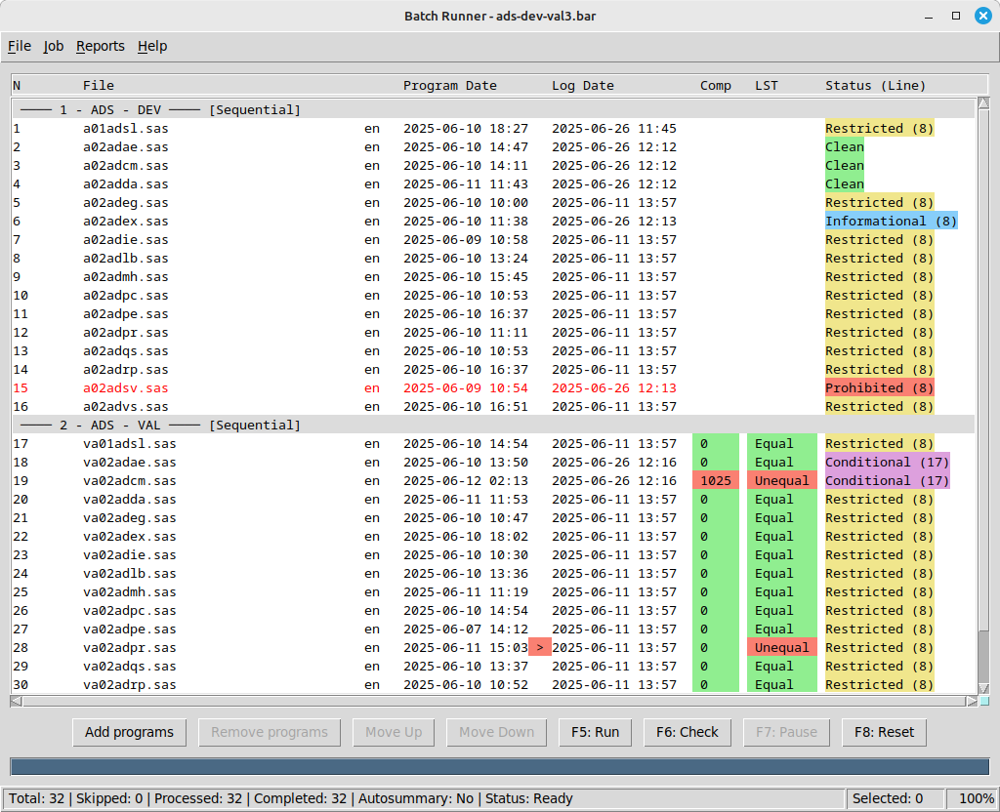
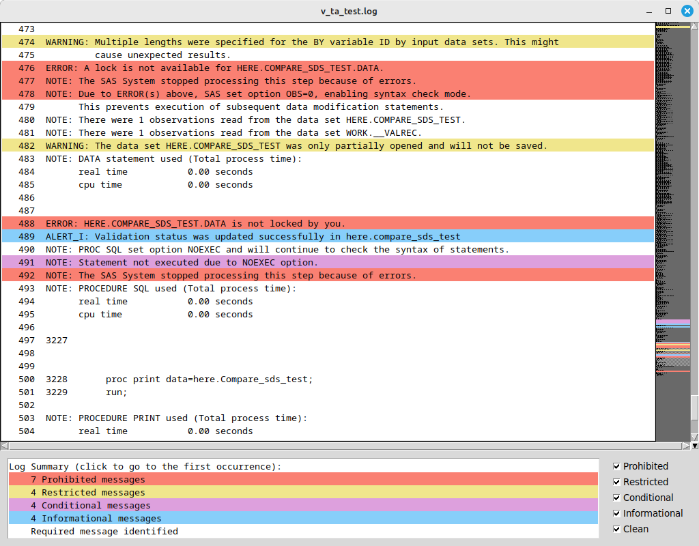
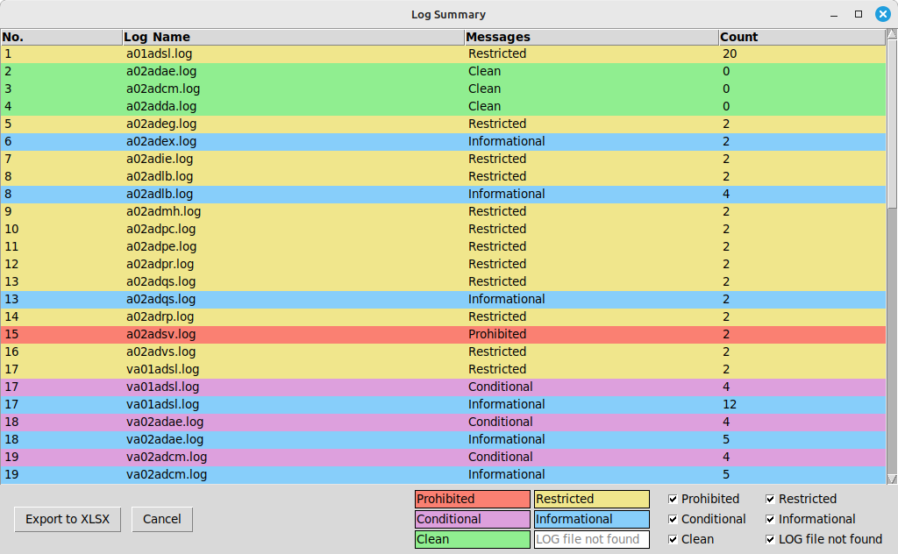

# Batch Runner (BaR)
<!--img src="splash_list480.png" width="32"-->
### Overview
**Batch Runner (BaR)** is a tool designed to execute and validate SAS and R programs in batch mode. It provides functionality to:

- Run multiple programs sequentially or in parallel
- Categorize programs for organized execution
- Validate program outputs (log\lst files, and optionally validation datasets for SAS programs)
- Generate detailed reports with color coding and filters
- Manage program execution with skip/pause/reset options
- Use all functions in 3 ways: through menus, hotkeys and context menus
- File associations can be registered for .bar, .log or .lst files
- Command line parameter can be used to open .bar, .log or .lst files, for example: [>> bar.exe "c:\Project1\ADB\adb.bar"]

The application supports multiple languages and provides extensive logging capabilities.

---

### Main menu
The **main menu** provides access to all application functionality through several sections:

1. File Menu - Job management (new, load, save, recent jobs), program management (add or remove programs), some settings
2. Job Menu - Program execution, sorting, applying categoies, run type, encoding (for SAS)
3. Reports Menu - Log analysis and reporting
4. Help Menu - Information about program, help articles

Each menu section contains related commands for specific operations.

---
File Menu contains commands for job management:

- New Job  (Ctrl+N) - Create a new empty job
- Load Job (Ctrl+O) - Open an existing job file (.bar)
- Save Job (Ctrl+S) - Save current job to file (.bar)
- Recent Files - List of recently opened jobs
- Add Programs (Ctrl+A) - Add programs to current job
- Remove Programs (Ctrl+R) - Remove selected programs
- Language (Ctrl+L) - Change application language (restart required)
- File associations - register or unregister .bar, .log and .lst file types to be opened with BaR (for current user only)
- Quit (Ctrl+Q) - Exit the application, suggest to save the job if it was changed, save settings in ini file

---
Job Menu contains commands for program execution and organization:

Sort By:
- Category - Sort programs by category
- Program - Sort programs by name
- Category+Program - Combined sort
- Reverse options available for each sort type
- Checkbox "Uncategorized last" to keep uncategorized section at the end of the list

Execution:
- Run (F5) - Execute selected programs and check logs
- Check (F6) - Validate logs without execution
- Pause (F7) - Pause current execution
- Reset (F8) - Reset execution status

Program Management:
- Skip (Shift+S) - Toggle skip status for selected programs
- Change Category (Shift+C) - Modify program category
- Change Run Type (Shift+R) - Set parallel/sequential execution for selected category
- Change Encoding (Shift+E) - Set encoding (en\\u8) for SAS programs

---
Reports Menu provides tools for log analysis:

- Summary Report  (F9) - Overview of log issues
- Detailed Report (F10) - Line-by-line log analysis
- Open Log Viewer (Enter) - View selected program log
- Open LST Viewer (Ctrl+Enter) - View selected program LST
- Checkbox "Autosummary" - Toggle automatic Log Summary generation at the end of each run

---
The main window displays the list of programs divided into groups or categories. Each group will be launched separately during the run, and you can specify whether the programs in the group should be run sequentially or in parallel.
You can add or remove programs from the list, save the list of loaded programs (job), and open saved lists (jobs).
After loading a job and after launching the programs, several checks are performed: for example, the dates of the programs and logs are compared, and messages in the LOG files are verified.
Detected issues are displayed in the main window with color coding for better visibility.

 

Columns:
1. Program index
2. Program filename
3. Encoding (for SAS only)
4. Program Date - Last program modification date
5. Log Date - Last LOG modification date
6. Comp - Comparison results from validation dataset (for SAS only, if available, this column can be disabled in ini file)
7. LST - Comparison details from validation LST file (Equal\\Unequal)
8. Status - Current LOG status (worst message type - PROHIBITED\RESTRICTED\CONDITIONAL\INFORMATIONAL or CLEAN if no such messages)

If the program date is later than the log date, a ">" mark will be added between the dates with red color highlighting.
When a validation SAS dataset is identified, the 'Comp' column will show the PROC COMPARE results with color highlighting: green for comparison result of 0 (match) and red for any non-zero result (mismatch).
LST column provide summary for comparison details identified in validation LST file with color coding - green for Equal, red for Unequal.
For all these cases text lines will be amended with appropriate tooltip.

Hotkeys:
- Up/Down - Navigate program list
- Ctrl+Up/Down - Move selected programs
- Enter - Open log viewer
- Ctrl+Enter - Open LST viewer
- Shift+S - Toggle skip status
- Shift+C - Change category
- Shift+R - Change run type
- Shift+E - Change encoding
Please see main menu for more hotkeys.

Context Menu (Right-click):
- Skip/Unskip
- Change Category
- Change Run Type
- Change Encoding
- Open Log/LST Viewer
- Remove Programs

---
The Log Viewer displays program log files with analysis:

Features:
- Color-coded message types (Prohibited, Restricted, Conditional, Informational)
- Line numbers for reference
- Summary section with message counts for each identified category
- Filter checkboxes to show/hide message types
- Minimap – a graphical schematic representation of the text with color-coded entries.

Navigation:
- Up/Down - Scroll line by line
- PgUp/PgDn - Scroll page by page
- Home/End - Jump to start/end
- Click summary items to jump to first occurrence
- Filter records (for example, turn off clean records), then select required message and switch filters again - you will be moved to required line in full or filtered log
- Use the minimap for quick navigation through the text.

Context Menu (Right-click):
- Copy selected text

Hotkeys:
- Esc/Enter - Close window
- Ctrl+C - Copy selected text
- Ctrl+G - Go to line
- F1 - Help

---
The LST Viewer displays program output (LST) files:

Features:
- Color-coded records
- Identification of proc compare information blocks, lines with matches/mismatches, color highlighting of records
- Line numbers for reference
- Summary section with detected records
- Minimap – a graphical schematic representation of the text with color-coded entries.

Navigation:
- Up/Down - Scroll line by line
- PgUp/PgDn - Scroll page by page
- Home/End - Jump to start/end
- Click summary items to jump to sections
- Use the minimap for quick navigation through the text.

Context Menu (Right-click):
- Copy selected text

Hotkeys:
- Esc/Enter - Close window
- Ctrl+C - Copy selected text
- F1 - Help

---
The Summary Report provides an overview of log issues:

 

Features:
- List of all programs with issue counts
- Color-coded by issue severity
- Filter checkboxes to show/hide issue types
- Export to Excel functionality
- Auto-filter and color-coding in excel report for easy navigation

Columns:
1. No - Program index
2. Log Name - Log filename
3. Messages - Message category
4. Count - Number of occurrences for each category
5. Comments - Empty column for notes

Hotkeys:
- Esc/Enter - Close window
- F1 - Help

---
The Detailed Report provides line-by-line log analysis:

Features:
- Complete log content with line numbers
- Color-coded by message type
- Filter checkboxes to show/hide message types
- Export to Excel functionality
- Auto-filter and color-coding in excel report for easy navigation

Columns:
1. No - Program index
2. Log Name - Log filename
3. Line - Line number
4. Category - Message type
5. Message - Log content
6. Comments - Empty column for notes

Hotkeys:
- Esc/Enter - Close window
- F1 - Help

---
The application settings are stored in bar.ini:

[EXECUTION]
- sas_exe - Path to SAS executable
- sas_par - SAS execution parameters
- r_exe - Path to R executable
- r_par - R execution parameters
- timeout - Execution timeout in seconds
- valreg - Regex for validation program names
- readcomp - True\False flag ot read validation dataset or not
- compid - Validation dataset ID column
- compdt - Validation dataset datetime stamp column
- comprc - Validation dataset result column

The last 5 options are used to:
1) Identify validation programs
2) Locate the validation SAS datasets
3) Map the PROC COMPARE results to each validation program in the list

[APPLICATION]
- language - Interface language (EN, etc.)
- colwidth - Column widths in main window
- resolution - Main window dimensions
- sumresolution - Summary report dimensions
- detresolution - Detailed report dimensions
- helpresolution - Help window dimensions
- threads - Max parallel threads
- uncat_last - Show uncategorized last
- no_intro - Skip intro message
- autosummary - Auto-generate summary report
- recentcount - Number of recent files to keep
- tooltipdelay - Tooltip delay in ms

[EXCL_SAS] - User-defined SAS exclusion rules (will remove SAS log message from other categories if identified)
[EXCL_R] - User-defined R exclusion rules (will remove R log message from other categories if identified)
[RECENT] - List of recently opened *.bar files

---
License overview

Usage Modes:

Free Mode — permanently available, includes only the basic features:
- run — batch execution of SAS/R programs (sequential mode only);
- check — automated checking of LOG and LST files using rule sets.

Paid Mode — enables extended features:
- parallel — batch execution of SAS/R programs in both sequential and parallel modes;
- categories — ability to assign categories to programs for more convenient display and for setting different run types (sequential\parallel) for each category.
- report — generation and export of summary/detailed reports in XLSX format;
- view — interactive viewing of LOG/LST files with color coding and message filtering.

A license can be either time-limited (with an expiration date) or perpetual;

When a time-limited license expires, the application automatically reverts to free mode with basic functionality.

[EULA](EULA.md)

[e-mail](mailto:kaan.batch.runner@gmail.com)
